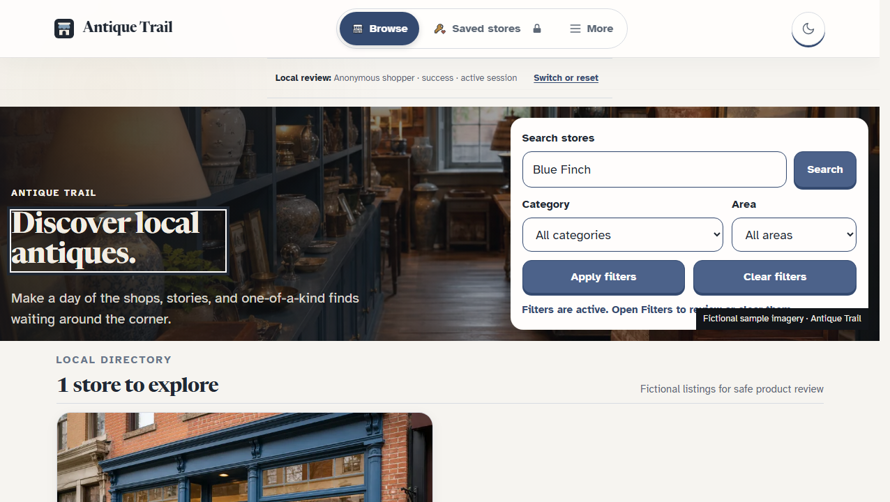
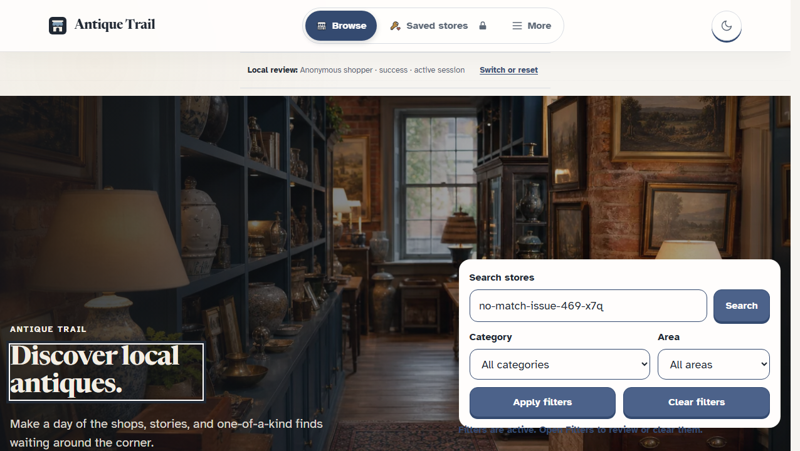
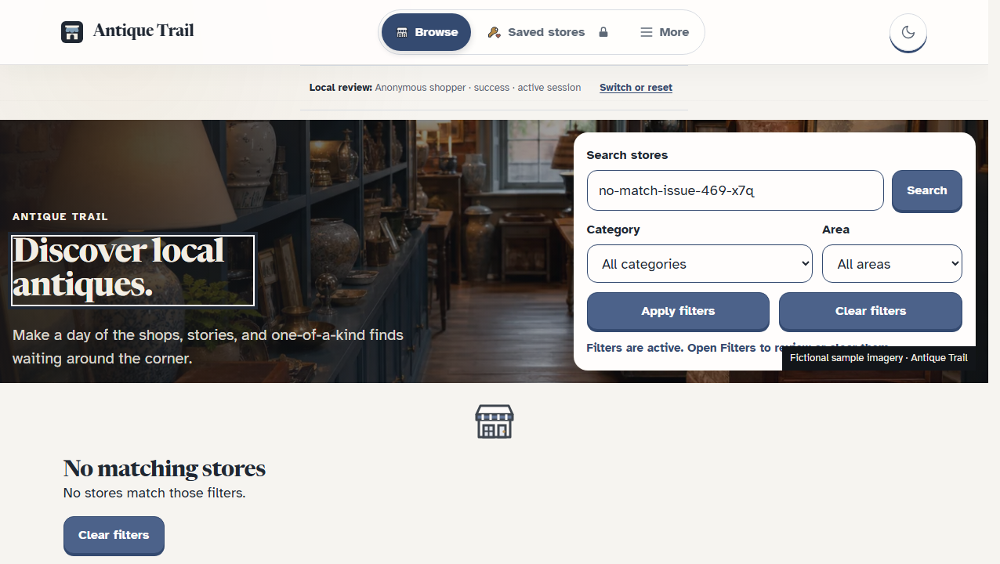
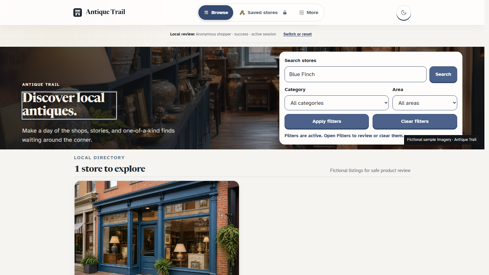
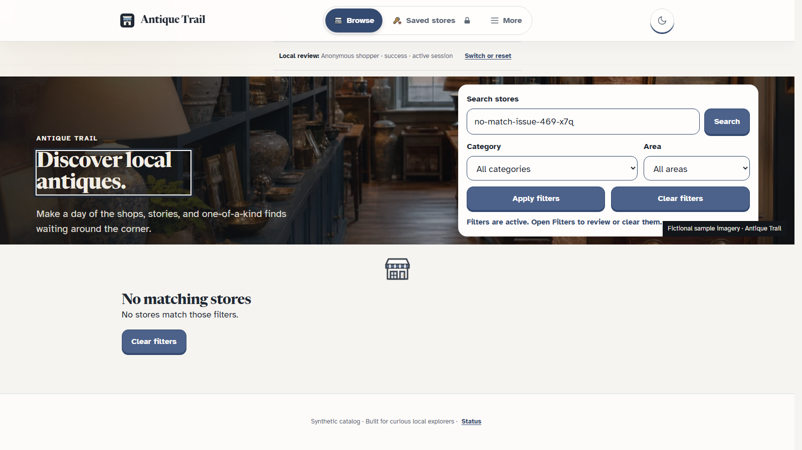

# Issue 469 acceptance

## Candidate and scope

- Issue: https://github.com/samarquis/AntiqueTrail/issues/469.
- Branch: `codex/issue-469-browse-results-viewport`.
- Admission baseline: `c9bb80250d5087ace3638059da09cd628bc1fad6`.
- Implementation candidate: `f987aa22f4e4416555ecdd326170bc073fbfa6c0`.
- Evidence package adds this record and screenshots only; application source remains at the implementation candidate above.
- Risk: standard, synthetic catalog data and presentation behavior only.
- Owned seams: Browse editorial hero, its directly related layout rules, and the direct test.
- Excluded: card density, catalog data, and search/filter semantics.
- Shared lane checked: #469 precedes #470, then #467; no overlapping owner or branch found.
- No provider, database, deployment, or production changes.

## Acceptance answer key

| Criterion | Observable evidence | Result |
| --- | --- | --- |
| Search result visibility | At 1276x720 and 1600x900, count is at y=539–570 and first result card begins at y=591. The first card enters both initial viewports. Its title starts at y=979, below both viewport heights; card density is excluded by the issue. | Pass |
| No-match recovery | At both desktop sizes, “No matching stores” heading is at y=585–616 and Clear filters is at y=659–707. Both are visible without scrolling through the hero. | Pass |
| Filter feedback and URL behavior | Active feedback is a `role=status` inside the search form and its white control surface. Enter search yields `/stores?q=Blue+Finch` and one result; Clear filters returns to `/stores` and 12 results. The compact results layout remains after clearing. | Pass |
| Keyboard and labels | Search input and button have accessible names. Keyboard activation expands Filters and reveals Category. | Pass |
| 320px reflow | At 320x740, document width is 305px and viewport client width is 320px; no horizontal page scrolling or browser errors. | Pass |

### Rendered evidence

Local Vite review-harness screenshots include its synthetic “Local review” status banner. Browser console and page errors were empty.

| View | Before | After |
| --- | --- | --- |
| Search, 1276x720 |  |  |
| Empty, 1276x720 |  |  |
| Search, 1600x900 | — |  |
| Empty, 1600x900 | — |  |
| Search and empty, 320x740 | — | [Search](search-320x740.png) · [Empty state](empty-320x740.png) |

## Verification

| Layer | Command or flow | Result | Applies to |
| --- | --- | --- | --- |
| Focused tests | `npx vitest run --maxWorkers=1 src/features/catalog/liveEditorial.test.tsx src/features/catalog/countLabels.test.tsx` | 7 passed | Candidate source SHA, local Windows checkout |
| Typecheck | `npm run typecheck` | Passed | Candidate source SHA |
| Lint | `npm run lint` | Passed, 0 errors and 16 warnings; none in changed files | Candidate source SHA |
| Format | `npm run format` | Passed | Candidate source SHA |
| Release tests | `npm run test:release` | 164 passed | Candidate source SHA |
| Build and media | `npm run build`; `node scripts/verify-seed-media.mjs --built-root dist` | Build passed; 10 paths verified, 0 errors | Candidate source SHA, local |
| Full unit suite | `npm run test` | 1,079 passed, 9 failed, 1 skipped across 165 files. Eight were 5-second timeouts; one password-replacement assertion failed. The nine selected cases passed when rerun serially (`--maxWorkers=1`) across the five unrelated suites. | Candidate source SHA, local Windows checkout |
| Desktop/mobile UI | Search, no-match, clear, keyboard filter toggle at 1276x720, 1600x900, and 320x740 | Acceptance table and screenshots above; no console/page errors | Candidate source SHA, local Vite review harness |
| Layout detector | `npx impeccable detect --json --scope layout src/features/catalog/components.tsx src/app/styles.css` | No findings (`[]`) | Candidate source SHA |
| Hosted/provider lifecycle | Not in issue scope | Not run | Unverified |
| Canonical production route | Deployment is separate and not authorized for this ticket | Not run | Unverified |

## TDD and Project Reflection preflight

- Red proof: the new status-location assertion failed before moving active-filter feedback into the search form.
- Green proof: the focused catalog tests pass after the change.
- Applied `L-20260927-02`: waited for the actual rendered content node before measuring layout.
- Applied `L-20260930-01`: omitted workstation and vault paths from this shared evidence.
- Applied `L-20260930-02`: verify the live linked-issue state after merge and close it explicitly if still open.
- `L-20260927-01` was rejected as inapplicable: this scoped hero adjustment changes no public heading or navigation.

## Source fingerprint

Reproduce from the candidate checkout:

```powershell
git diff --binary --full-index c9bb80250d5087ace3638059da09cd628bc1fad6...HEAD -- src/app/styles.css src/features/catalog/components.tsx src/features/catalog/liveEditorial.test.tsx | git hash-object --stdin
```

Current source-only fingerprint: `7c4dce53cfd86177ff3550984d39ffd14546fb70`.

## Independent review and gates

- Standards/Spec verdicts, parent exact-head review, required checks, merge, resulting `main` SHA, and live issue closure are recorded on the linked PR and issue.

Hosted and production evidence remain unverified because deployment is outside this ticket. Any affected source, configuration, fixture, or integration change invalidates the corresponding proof.
